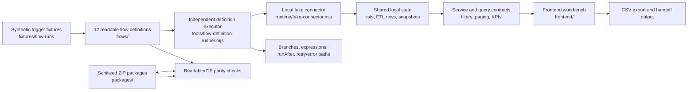
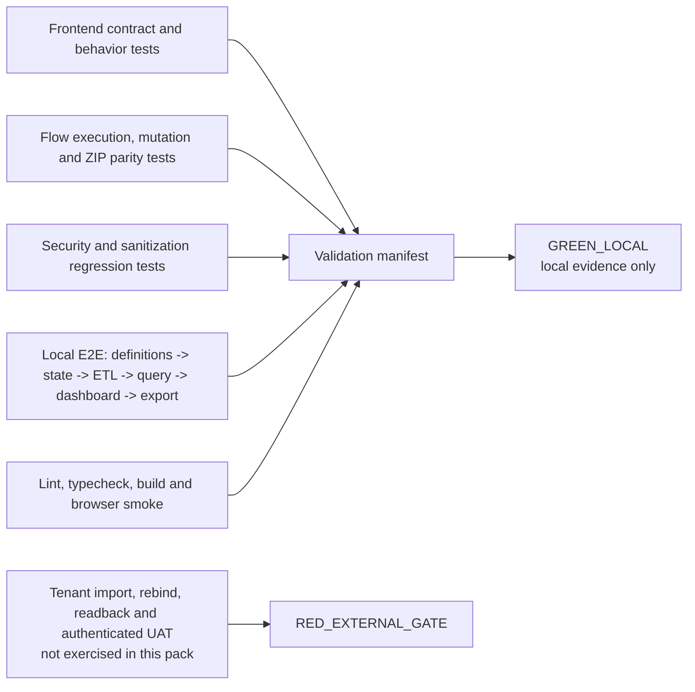

# Architecture and validation map

This document gives a visual map of the public Escalation App pack. It is documentation only: the application logic, flow definitions, fixtures, package layout and tests are unchanged.

For the cross-repository view, see the [portfolio architecture map](PORTFOLIO_MAP.md).

## Runtime flow

The local executor evaluates the included definitions against deterministic fixtures. The resulting state is then consumed by the same local ETL, query, dashboard and export path. No network connector or tenant is required for this local flow.

## Test and status flow

`GREEN_LOCAL` means that the recorded local command and scope passed. It does not prove connector authentication, tenant permissions, cloud import, saved-definition readback or authenticated UAT. The external items remain explicitly `RED_EXTERNAL_GATE` in the manifests.

## Main entrypoints

- `frontend/package.json` is the authoritative JavaScript command list.
- `tools/flow-definition-runner.mjs` is the independent local definition executor.
- `tools/flow-mock-runner.mjs` preserves the compatibility wrapper for all twelve definitions.
- `tools/local-e2e.mjs` exercises the shared local state through export and handoff.
- `manifests/validation-manifest.json` records the latest local evidence and remaining external gates.
