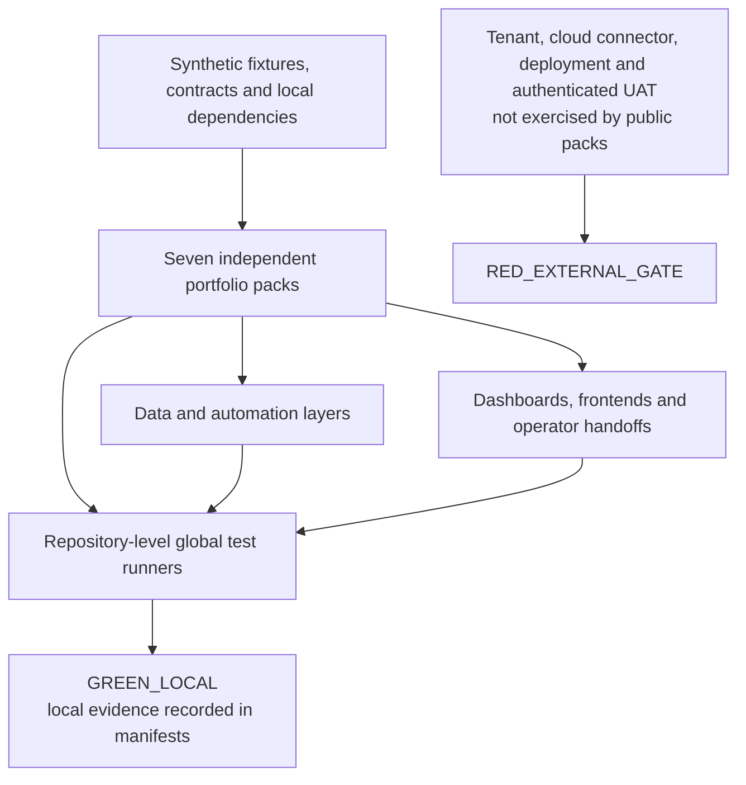

# Portfolio architecture map

This is the cross-repository view of the seven public portfolio packs. Each repository is independently runnable with synthetic data; the map shows the shared evidence boundary rather than a single deployable product.

## Portfolio-level flow

## The seven packs

| Repository | What it delivers | Problem it solves | Local contract |
| --- | --- | --- | --- |
| `escalation-app-portfolio` | End-to-end workbench, service/query contracts, 12 automation definitions, ETL/KPIs and export | Moves escalation queues into accountable, auditable resolution workflows | 12 definitions -> shared local state -> ETL/query -> dashboard/export |
| `payment-tracker-automation-portfolio` | Frontend, workbook ETL, 5 provisioning units, 67 packages, SharePoint-shaped contracts and durable outbox | Controls the payment lifecycle with reliable state, notification recovery and duplicate prevention | 5 units + 67 packages -> ETL/contracts -> SQLite/outbox/frontend |
| `banking-dashboard-portfolio` | Banking data product with loaders, normalization, SQL, two SQLite handoffs, mappings and browser reporting | Replaces workbook consolidation with inspectable, repeatable operational reporting | Fixtures -> validation/normalization -> SQLite/query -> generated dashboard |
| `ledger-dashboard-portfolio` | Ledger exception product with fail-closed staging, five SQLite handoffs, typed contracts and reports | Makes exceptions visible while preventing unsafe or partial data promotion | Validated inputs -> transactional staging -> SQLite/query -> typed UI |
| `project-dashboard-portfolio` | 17-column portfolio contract, parser, warnings, automation order and generated browser data | Standardizes project portfolio reporting and catches malformed rows before presentation | Workbook -> inspection/validation -> transformation -> dashboard |
| `invoice-process-dashboard-portfolio` | 23-column invoice contract, ETL, two SQLite handoffs, SLA/calendar flows, trends and export | Makes invoice aging, ownership, SLA workload and bottlenecks measurable | Invoice fixture -> ETL/promotion -> dashboard/trends -> export |
| `payment-dashboard-portfolio` | Feed-to-browser analytics product with vendor enrichment, ETL, SQL/SQLite, operational views and export | Supports investigation of blocked payments, suppliers, trends and repeatable reporting | Vendor/payment feeds -> ETL/SQLite -> generated views -> CSV |

## What the global tests mean

The global or umbrella test is the repository's integration-oriented local runner. It connects multiple contracts in one invocation instead of testing only isolated functions. Depending on the pack, it covers combinations of fixture loading, ETL, schema/database handoff, flow or automation shape, generated frontend data, browser behavior, export, package parity, sanitization and manifest evidence.

Examples are documented in each repository's `docs/ARCHITECTURE.md`:

- Escalation: frontend suites, flow execution/parity, security, local E2E, lint, typecheck, build and browser smoke.
- Payment Tracker: `tools/run_all.py` across Python, Node, ETL, outbox, browser, package and manifest gates.
- Five TSS packs: synthetic E2E plus contract/preflight, unit and browser checks appropriate to each pack.

These tests are valuable because they detect drift between layers, but they remain local evidence. A global test cannot prove a real tenant import, connector binding, remote permission, production deployment or authenticated UAT. Those claims stay `RED_EXTERNAL_GATE` until exercised in an authorized environment.

## Common status vocabulary

- `GREEN_LOCAL`: the named local command and scope passed against the synthetic public pack.
- `RED_EXTERNAL_GATE`: an external integration or tenant action was intentionally not exercised.
- A local `GREEN_LOCAL` result never clears an external `RED_EXTERNAL_GATE`.

