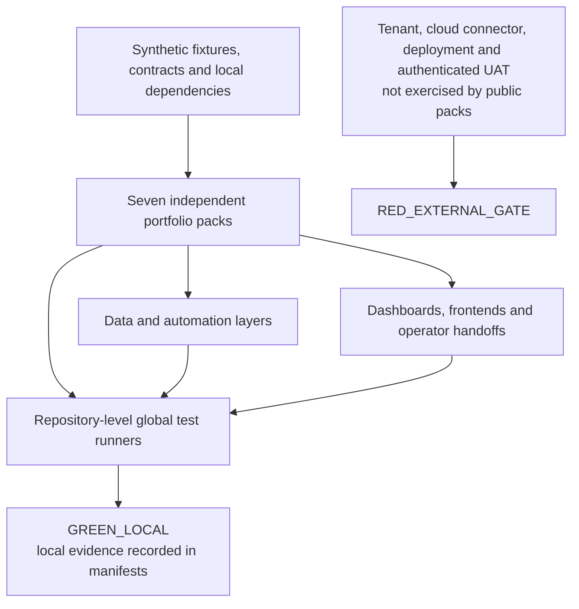

# Portfolio architecture map

This is the cross-repository view of the seven public portfolio packs. Each repository is independently runnable with synthetic data; the map shows the shared evidence boundary rather than a single deployable product.

## Portfolio-level flow

## The seven packs

| Repository | Main capability | Local contract |
| --- | --- | --- |
| `escalation-app-portfolio` | Flow-driven escalation workbench | 12 definitions -> local state -> ETL/query -> dashboard/export |
| `payment-tracker-automation-portfolio` | Payment workflow and durable notification outbox | 5 provisioning units + 67 packages -> ETL/SQLite -> frontend/outbox |
| `banking-dashboard-portfolio` | Banking operations reporting | Fixtures -> normalization -> SQLite/query -> browser dashboard |
| `ledger-dashboard-portfolio` | Ledger and exception reporting | Validated staging -> transactional SQLite handoff -> typed browser layer |
| `project-dashboard-portfolio` | Project and process-improvement reporting | Workbook -> 17-column validation -> generated dashboard |
| `invoice-process-dashboard-portfolio` | Invoice process monitoring | Invoice fixture -> ETL/SQLite -> overview/details/trends/export |
| `payment-dashboard-portfolio` | Payment operations reporting | Vendor/payment feeds -> SQLite -> filters/trends/supplier/block views |

## What the global tests mean

The global or umbrella test is the repository's integration-oriented local runner. It connects multiple contracts in one invocation instead of testing only isolated functions. Depending on the pack, it covers combinations of fixture loading, ETL, schema/database handoff, flow or automation shape, generated frontend data, browser behavior, export, package parity, sanitization and manifest evidence.

Examples are documented in each repository's `docs/ARCHITECTURE.md`:

- Escalation: frontend suites, flow execution/parity, security, local E2E, lint, typecheck, build and browser smoke.
- Payment Tracker: `tools/run_all.py` across Python, Node, ETL, outbox, browser, package and manifest gates.
- Five TSS packs: synthetic E2E plus contract/preflight, unit and browser checks appropriate to each pack.

These tests are valuable because they detect drift between layers, but they remain local evidence. A global test cannot prove a real tenant import, connector binding, remote permission, production deployment or authenticated UAT. Those claims stay `RED_EXTERNAL_GATE` until exercised in an authorized environment.

## Common status vocabulary

- `GREEN_LOCAL`: the named local command and scope passed against the synthetic public pack.
- `RED_EXTERNAL_GATE`: an external integration or tenant action was intentionally not exercised.
- A local `GREEN_LOCAL` result never clears an external `RED_EXTERNAL_GATE`.

